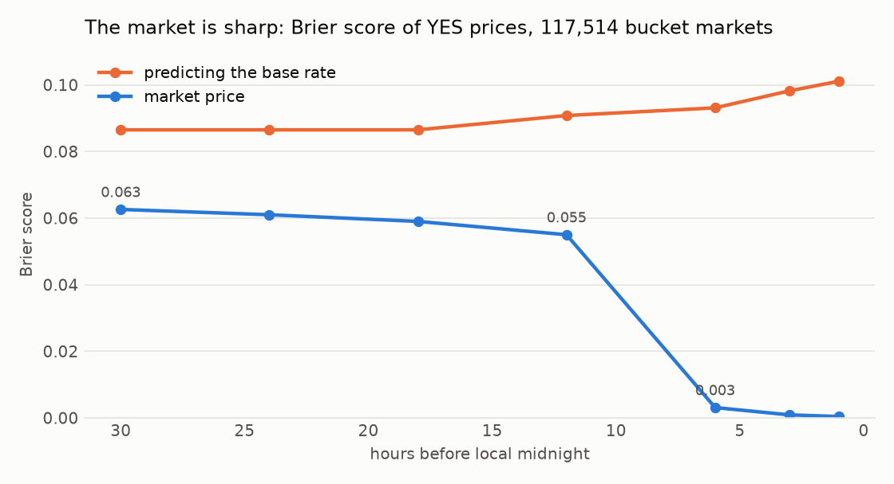
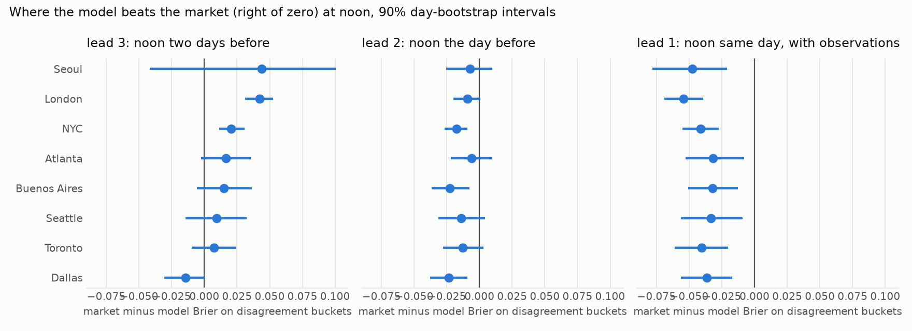
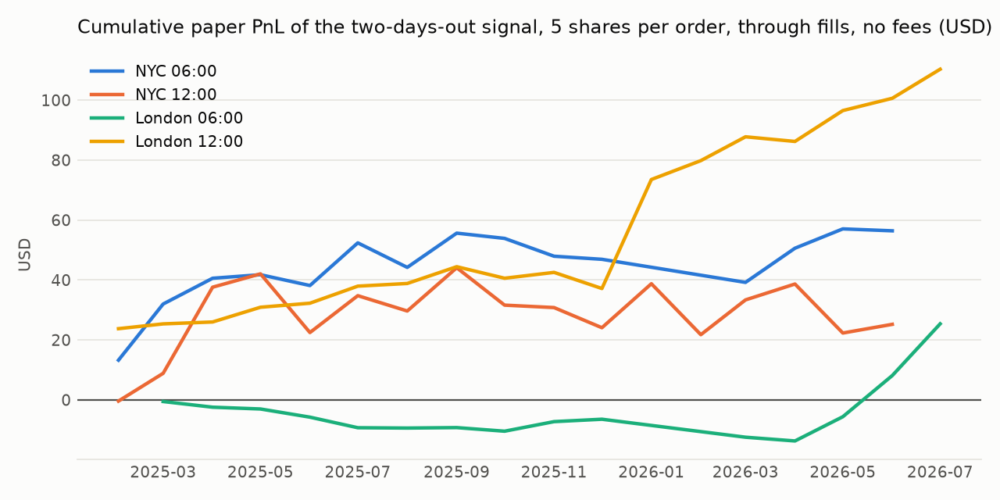
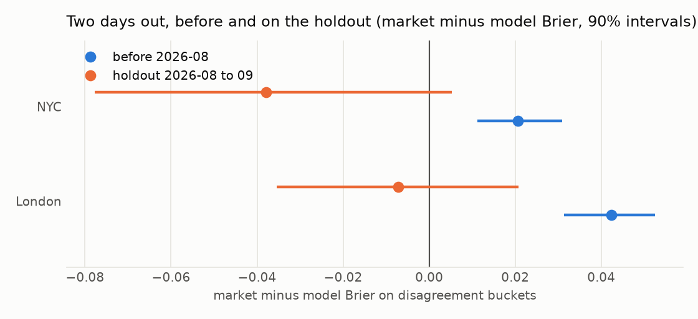
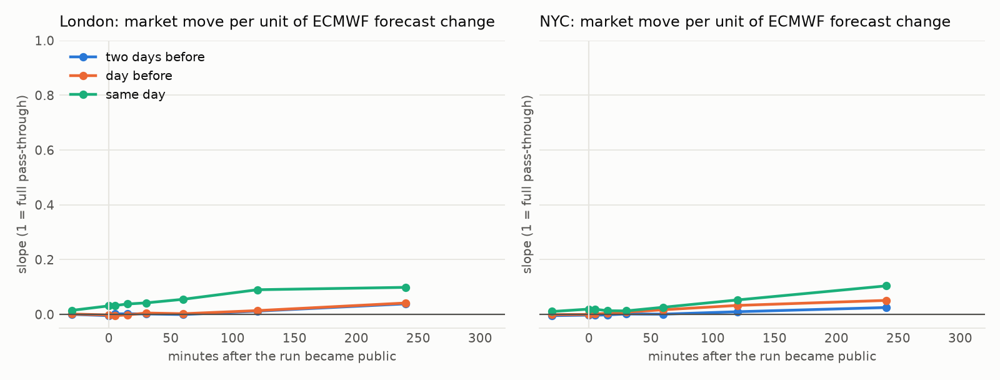

# Is there a tradeable edge in Polymarket's daily temperature markets?

[](https://github.com/mkhlndrv/polymarket_trading/actions/workflows/ci.yml)

Polymarket lists a market every day for 56 cities: *"Highest temperature in New York on 3 October?"*, with one YES/NO contract per 2 °F or 1 °C bucket. Weather forecasts are public and good. Are the prices worse than a well-calibrated forecast model, and if so, can a small maker account collect the difference?

**My answer, after nine months of market data and a year and a half of forecast archives: no.** A calibrated model built from ECMWF, GFS and GEFS beats the market on probability only two days before the day, that edge is worth about 5c per share before adverse selection and nothing after, and it disappears entirely on unseen 2026 data because the market itself got sharper. I ended the project with the 200 USD unspent and a documented negative result, which is the outcome the research plan was designed to produce if the edge was not there.

This repository is the full research programme I ran to answer it: data pipelines with real publication times, a ground-truth rebuild that matches Polymarket's own resolutions, a probabilistic model scored point-in-time against prices, a backtest with fills inferred from the on-chain trade tape, a one-shot holdout, and a live paper trader. Every hypothesis and test run is logged, in order, in [`docs/PLAN.md`](docs/PLAN.md).

## The result in five figures

**1. The market is sharp.** Brier score of YES prices against resolution, by hours before the local day ends, over 117,514 bucket markets. The base rate is what you get by predicting the average outcome.



**2. The model wins only two days out.** Market minus model Brier on the buckets where they disagree by 10c or more (positive = model better), eight cities, noon decisions, 90% day-bootstrap intervals. Same day the market is far ahead even when the model also knows the running maximum from the morning's METARs.



**3. The paper edge is thin.** Maker orders at 10c of edge, 5 shares each, filled only when the trade tape shows a print through the level. The model expects 18 to 20c per filled share and realizes 1 to 6c: about 70% of the paper edge is adverse selection.



**4. It does not hold out of sample.** The same configuration on the untouched August to September 2026 window, scored once.



**5. And it is not a timing edge either.** How much the market's implied high moves per unit of ECMWF forecast change, by minutes after the run became public. The market does not follow the runs at all; its information comes from elsewhere.



## What I built

```
Gamma API ──► markets, rules, resolutions ─┐
CLOB API ───► 1-minute prices per bucket   │        features at the decision time t
on-chain fills (27.9M) ───────────────────►│ ──►   (only runs public before t,        ──► t-EMOS by CRPS ──► bucket
IEM METAR archive ──► displayed daily high ┤        only METARs reported before t)          + out-of-sample      probabilities
ECMWF / GFS / GEFS / NBM GRIB archives ───►│                                                calibration           │
  (byte-range 2 m temperature, Last-Modified = publication time)                                                  ▼
                                                                     market scoring (Brier on disagreement, bootstrap)
                                                                     tape backtest (maker fills: touch / through)
                                                                     holdout (once) · timing study · paper trader
```

| Stage | Module | What it does | Known-answer check |
|---|---|---|---|
| load | `markets.py` | Gamma events → bucket markets, parsed rules (resolution source, station, unit), resolutions | parsers against real event dumps |
| load | `prices.py`, `trades.py` | CLOB price history; on-chain fills from the SII-WANGZJ dataset | fill shares equal Gamma volume within 1% |
| load + clean | `observations.py` | IEM METARs, the displayed-value transform (T-group tenths → rounded °F, whole °C) | rebuilt resolutions match Polymarket's: 99.7% (F), 98.6% (C), 100% (Hong Kong) |
| load | `forecasts.py` | 2 m temperature from ECMWF, GFS, GEFS, NBM GRIB archives, one byte range per step, publication time from Last-Modified | GRIB decode + interpolation on synthetic fields |
| target | `labels.py` | highest displayed value per station and local day | matches Phase 3 labels on every market day |
| model | `model.py` | features per decision time, EMOS fit by CRPS (Student t), variance from ensemble spread, out-of-sample scale calibration, bucket probabilities, market scoring | CRPS closed forms vs numeric integration, parameter recovery, point-in-time leak tests |
| economics | `backtest.py` | maker orders with fills inferred from taker prints (touch, through, haircut) | fill rules on a synthetic tape |
| checks | `timing.py`, `market_checks.py` | price reaction to run releases; market calibration and taker losses | |
| live | `collector.py`, `paper_trader.py` | order-book, observation and forecast snapshots; paper orders with inferred fills (systemd units in `deploy/`) | gating, order and fill logic |

Three things decide whether results like these are real. I enforced them in code, not by convention:

- **Point in time.** A decision at time t sees forecasts whose files were public before t (publication is 4 to 8 hours after a model's nominal init time), observations reported before t, and prices before t. Tests fail if any input is timestamped after its decision.
- **The right target.** Markets resolve on the highest *displayed* value of a named station's hourly reports on a web page, after unit conversion and rounding, over the local clock day. That is not the official daily maximum and not a reanalysis. Rebuilding it from METAR archives and matching Polymarket's actual resolutions (Phase 3) is what made every later score meaningful.
- **A holdout used once.** I kept August to September 2026 untouched until the configuration was fixed, then scored it once (T17). It is where the edge disappeared.

## Results in numbers

| Test | Data | Result |
|---|---|---|
| Market calibration (T1) | 117,514 bucket markets, 2025-01 to 2026-09 | Brier 0.061 at 24 h vs 0.087 base rate; near-certain by 18:00 local |
| Taker losses (T4) | 27.9M fills | takers lose 0.3c per share gross; adverse selection concentrated in 35 to 90c sells |
| Ground truth (T6) | 11,037 resolved events, 1.35M METARs | 99.7% match (°F), 98.6% (°C), 205 mismatches listed |
| Model vs market, NYC (T10, T12) | 577 days, four decision hours | lead 3: +0.021 to +0.037 Brier for the model; lead 2: −0.01 to −0.02; lead 1: −0.05 to −0.06 |
| Same-day with observations (T11) | running max + last METAR, censored fit | CRPS 0.81 → 0.61 °C, still −0.04 against the market |
| Eight cities (T14) | noon decisions | London +0.042, NYC +0.021 at lead 3; the six newer cities inconclusive |
| Tape backtest (T13, T16) | 2025-02 to 2026-07 | London noon +5.5c per share on through fills (interval excludes zero), NYC +0.9c; negative under a 50% haircut on winning fills |
| Holdout, once (T17) | 2026-08 to 09 | London −0.007 (−0.036 to +0.021), NYC −0.038: the edge is gone |
| Release timing (T19) | 16,000 run publications | slope of market on model move 0.00 at 15 min, ≤ 0.05 at 4 h |
| NBM as an input (T15) | 14 CONUS stations | changes every score by < 0.002 |

Fees are documented and small: makers pay nothing, takers 0.05·p·(1−p) per share, makers get 25% of taker fees back. Adverse selection, not fees, is the cost that matters.

## Why the edge closed

The model's own quality did not change: its CRPS on the holdout months is better than in-sample. What changed was the market: two days before the day its Brier fell from 0.10 to 0.065 between 2025 and late 2026, and it disagrees with the model on a third as many buckets. The prices also do not respond to ECMWF or GFS publications, so whoever moves them is using other information, most likely blended products and their own quoting models. A public-data forecaster arriving in late 2026 is late to this market, and I would rather know that from a 60-day holdout than from a live account.

## Reproduce

```bash
uv sync && make test                 # environment from uv.lock, 42 known-answer tests
make report                          # figures + models/metrics.json from the committed reports
make data                            # rebuild data/ from the sources (hours; 36 GB of fills stream)
make train                           # model, ranking, backtest, timing study → reports/
make notebooks                       # execute notebooks/ in place
docker build -t weather-edge . && docker run --rm -v "$(pwd)/reports:/app/reports" weather-edge
```

`data/` is git-ignored and regenerable (see [`data/README.md`](data/README.md)); `models/metrics.json`, `models/emos_params.json` and `reports/` are committed so the results can be read without re-running anything. The live tools need the environment variables in `.env.example`.

## Repository

```
src/weather_edge/   the package (python -m weather_edge <stage>)
tests/              one test module per package module
notebooks/          01 market facts · 02 model walkthrough · 03 results
reports/            markdown output of every phase; figures/ the plots above
models/             metrics.json, last fitted EMOS parameters
docs/PLAN.md        research log: hypotheses H1 to H17, tests T1 to T19, verified facts, open questions
deploy/             systemd units for the collector and the paper trader
```

Data sources: Polymarket Gamma, CLOB and data APIs; [SII-WANGZJ/Polymarket_data](https://huggingface.co/datasets/SII-WANGZJ/Polymarket_data) on-chain fills; Iowa Environmental Mesonet ASOS archive; ECMWF open data (CC-BY 4.0) via its Google Cloud mirror; NOAA GFS, GEFS and NBM on AWS Open Data.
